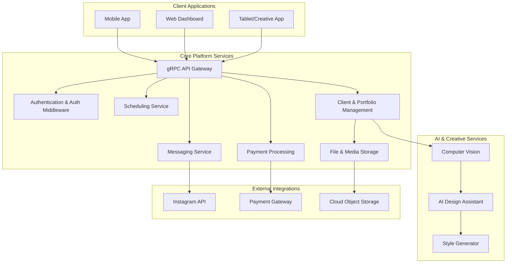
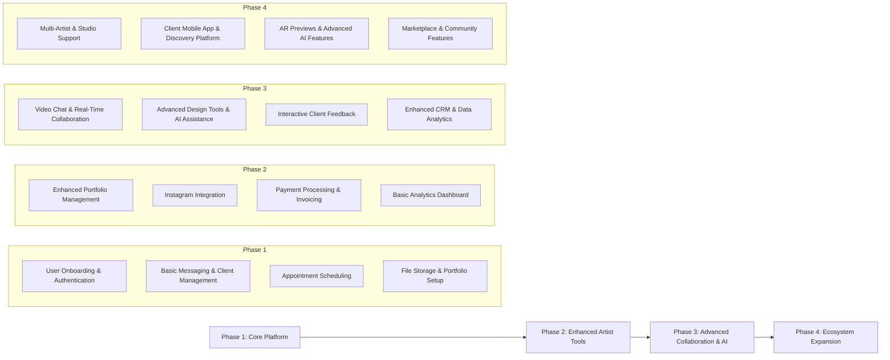
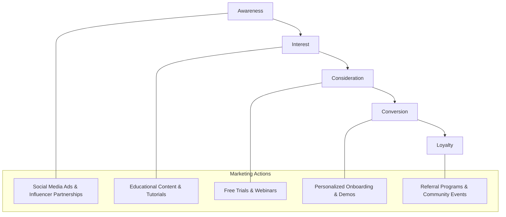
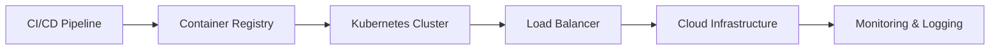

# SyncInk Tattoo Artist Client Management SaaS

## Overview

### The Idea
Tattoo artists often struggle with managing client inquiries through Instagram or WhatsApp, leading to disorganized communication and lost opportunities. This SaaS platform provides tattoo artists with a **dedicated back-office (web application) and mobile app** to streamline client interactions, manage appointments, share designs, and facilitate real-time communication.

### Business Model & Differentiation
- **Each tattoo artist owns a customizable platform**: Every client has an isolated database ensuring data privacy and control.
- **Configurable Backoffice (Web App) => Configures Mobile App**: Artists manage their services through a web dashboard that customizes the mobile client experience.
- **Multi-User Support**: Studios can onboard multiple users (e.g., assistants, managers).
- **Integrations with Instagram & WhatsApp**: Artists can maintain their existing channels while enhancing client experience.

## Business Plan

### Market Opportunity
- **Fragmented Communication**: Artists rely on DMs without a structured way to track conversations.
- **Disorganized Client Management**: No centralized system to store client history, deposits, and design preferences.
- **Lost Revenue & Inefficiencies**: Missed appointments, disorganized portfolios, and limited payment options hinder revenue potential.

### Unique Value Proposition
- **All-in-One Platform**: A tailored system that manages bookings, conversations, file sharing, and payments.
- **AI & AR Enhancements (Future Feature Roadmap)**: Style analysis, AI-generated design inspirations, and AR previews.
- **Scalability & Multi-Tenant Customization**: Each artist gets a white-label solution.

## Monetization Strategy

### Subscription Plans
| Plan | Price | Features |
|------|--------|--------------------------------|
| **Basic (Free)** | $0 | 5 active clients, messaging, limited portfolio |
| **Professional** | $29/month | Unlimited clients, video calls, scheduling, payments |
| **Studio** | $99/month | Multi-user access, custom branding, AI tools |

### Additional Revenue Streams
- **Transaction Fees**: Small fee per payment processed.
- **Premium Add-ons**: AI design tools, AR previews.
- **Enterprise Solutions**: Custom deployments for large studios.

## Technical Architecture

### Backend Server (Go + gRPC + PostgreSQL)
- **Microservices-Based**: gRPC for efficient communication.
- **Authentication & Authorization**: OAuth/JWT-based security.
- **Messaging & Scheduling**: Real-time text/video chat, calendar management.
- **File Storage & Portfolio**: Cloud-based image storage.
- **AI Services (Future Expansion)**: Generative AI for design assistance.
- **Multi-Tenant Database**: Each client gets an isolated database.

### Web Backoffice (Next.js/React)
- **User Onboarding & Client Management**: Artist dashboard to manage services.
- **Appointment Scheduling & Analytics**: Calendar integration and business insights.
- **Customization Options**: Configure branding and mobile app settings.

### Mobile App (iOS First, React Native for Cross-Platform Expansion)
- **Conversations & File Sharing**: Secure messaging & media storage.
- **Live Video Calls**: Remote consultations.
- **Client Interactions**: Appointment bookings & feedback collection.

## Hosting & Deployment Strategy

### Google Cloud Platform (GCP) with Kubernetes (GKE)
- **Multi-Region Deployment**: Ensures low latency and high availability.
- **Containerized Services (Docker + Kubernetes)**: Scalable microservices architecture.
- **CI/CD Pipeline**: Automated deployments using GitHub Actions.
- **Observability**: Prometheus & Grafana for monitoring.

## Marketing Strategy

### Target Audience
- **Independent Tattoo Artists**: Struggling with managing client requests.
- **Tattoo Studios**: Needing multi-user & team management features.
- **Tattoo Enthusiasts (Future Expansion)**: Potential discovery platform.

### Growth Tactics
- **Social Media & Influencers**: Partner with tattoo artists to demonstrate value.
- **Referral Program**: Incentivize early adopters to invite peers.
- **Freemium-to-Paid Model**: Encourage upgrades through feature limitations.
- **Industry Events & Conventions**: Showcase at tattoo conventions.

## Next Steps
- **MVP Development**: Prioritize core messaging, scheduling, and payments.
- **Beta Testing**: Early adoption by small studios and individual artists.
- **Iterate & Scale**: Expand features based on user feedback.

---
Would you like to refine any section, add more details, or focus on specific implementation strategies?


## Business Plan & Technical Strategy

### 1. Core Value Proposition

The platform solves three critical problems for tattoo artists:
- **Communication Fragmentation**: Consolidates client communications from Instagram/WhatsApp into one professional platform
- **Client Management Complexity**: Centralizes client records, designs, and scheduling
- **Business Operations**: Streamlines appointment management, payments, and client onboarding

### 2. Multi-Tenant Architecture

#### Database Strategy
- **Tenant Isolation**: Each tattoo studio gets their own dedicated database schema within a shared Postgres instance
- **Scaling Approach**:
  - Initial phase: Single Postgres instance with schema-based separation
  - Growth phase: Database sharding based on geographic regions
  - Enterprise phase: Dedicated databases for high-volume customers

#### Security & Privacy
- End-to-end encryption for messages and files
- GDPR/CCPA compliance built-in from day one
- Regular security audits and penetration testing

### 3. Technical Implementation

#### Backend (Go)
- gRPC services with protocol buffers
- Core microservices:
  - Authentication Service
  - Messaging Service
  - File Management Service
  - Scheduling Service
  - Notification Service
  - Integration Service (Instagram/WhatsApp)

#### Infrastructure (GCP)
- **Multi-Region Setup**:
  - Primary regions: US, Europe, Asia
  - Cloud SQL for Postgres with cross-region replication
  - Cloud Storage for file management
  - Cloud CDN for static assets

#### Kubernetes Architecture
- Regional GKE clusters
- Horizontal pod autoscaling
- Service mesh for inter-service communication
- CI/CD with Cloud Build and ArgoCD

#### Web Admin (Next.js)
- Server-side rendering for performance
- Real-time updates with WebSocket
- Responsive design for desktop/tablet
- Role-based access control

#### Mobile App (Initial iOS Focus)
- Native iOS development for optimal performance
- Offline-first architecture
- Push notifications
- Image/video optimization

### 4. Monetization Strategy

#### Subscription Tiers

**Solo Artist: $29/month**
- Single artist account
- Up to 100 active clients
- Basic scheduling
- File sharing
- Chat functionality
- Instagram integration

**Studio Starter: $79/month**
- Up to 3 artist accounts
- Up to 300 active clients
- Advanced scheduling
- Video calls
- Analytics dashboard
- WhatsApp integration
- Custom branding

**Studio Pro: $199/month**
- Unlimited artist accounts
- Unlimited clients
- Priority support
- API access
- Advanced analytics
- White-label option
- Custom integrations

#### Additional Revenue Streams
- Payment processing fees (2.5% + $0.30)
- Storage upgrades
- Premium features (AI design tools, AR previews)
- Enterprise customization

### 5. Marketing Strategy

#### Launch Phase (Months 1-3)
- Focus on single geographic market (e.g., major US city)
- Direct outreach to 100 premium tattoo studios
- Free 3-month trial for early adopters
- Instagram influencer partnerships

#### Growth Phase (Months 4-12)
- Expand to top 10 tattoo markets
- Content marketing (tutorials, case studies)
- Referral program ($100 credit per referral)
- Tattoo convention presence
- Instagram/TikTok ads targeting artists

#### Scale Phase (Year 2+)
- International expansion
- Industry partnerships
- Community building
- Educational webinars
- User-generated content promotion

### 6. Development Roadmap

#### Phase 1 (Months 1-3)
- Core backend services
- Basic web admin interface
- iOS app with essential features
- Initial Instagram integration

#### Phase 2 (Months 4-6)
- Advanced scheduling
- File management
- Payment processing
- Basic analytics

#### Phase 3 (Months 7-9)
- Video calls
- WhatsApp integration
- Enhanced analytics
- Multi-artist support

#### Phase 4 (Months 10-12)
- API access
- White-label options
- Advanced customization
- Performance optimization

### 7. Success Metrics

#### Business KPIs
- Monthly Recurring Revenue (MRR)
- Customer Acquisition Cost (CAC)
- Lifetime Value (LTV)
- Churn Rate
- Active Users

#### Technical KPIs
- System Uptime
- API Response Time
- Error Rates
- App Store Rating
- Support Ticket Resolution Time

### 8. Risk Mitigation

#### Technical Risks
- Data backup strategy
- Disaster recovery plan
- Rate limiting
- DDoS protection
- Regular security audits

#### Business Risks
- Competitive analysis
- Legal compliance review
- Insurance coverage
- Customer feedback loops
- Market monitoring

### 9. Support Strategy

#### Onboarding
- Personalized setup assistance
- Video tutorials
- Documentation
- Email/chat support

#### Ongoing Support
- In-app chat support
- Priority email support for higher tiers
- Regular check-ins with premium customers
- Community forums

### 10. Future Expansion

#### Feature Roadmap
- AI-powered design suggestions
- AR tattoo preview
- Client mobile app
- Marketplace for flash designs
- Integration with payment platforms

#### Market Expansion
- Android app development
- International language support
- Regional payment methods
- Local compliance adaptations


**The Idea:**
Tattoo artists today manage client inquiries via Instagram or WhatsApp, where important messages can get lost in the noise. Your platform creates a dedicated back‑office where tattoo artists can onboard clients and manage communications—all through a configurable mobile app. In the future, the system will allow clients to work with multiple tattoo artists on one account, support real‑time messaging (text and video), file sharing for design ideas, and even AI-driven features to help both artists and clients generate creative tattoo designs.

---

## Business Opportunity & Value Proposition

### Market Opportunity

- **Fragmented Communication:** Artists are overwhelmed by messages on social media, where inboxes lack organization and filtering.
- **Inefficient Client Management:** No central repository exists for client history, appointments, and design feedback.
- **Lost Revenue & Opportunity:** Disorganized channels can lead to missed bookings and lost creative opportunities.

### Unique Value Proposition

- **Centralized Client Management:** A dedicated mobile back‑office to onboard, schedule, and communicate with clients.
- **Tailored Tools for Tattoo Artists:** Features like portfolio management, file sharing, appointment scheduling, and secure messaging—all designed for the tattoo industry.
- **AI Integration:** Leverage AI for design inspiration and style analysis, helping artists generate fresh ideas and providing clients with personalized recommendations.
- **Future Scalability:** Plans to support multi-artist accounts, studio management, and additional creative tools (e.g., AR previews) to create a full ecosystem for tattoo business operations.

---

## Revenue Model

### Subscription Tiers

- **Basic (Free):**
  - Limited client onboarding and messaging.
  - Basic portfolio management.
  - Up to 5 active clients.

- **Professional (e.g., $29/month):**
  - Unlimited client management.
  - Advanced messaging (text and video chat).
  - Integrated appointment scheduling.
  - Payment processing and Instagram integration.
  - Basic analytics dashboard.

- **Studio (e.g., $99/month):**
  - Support for multiple tattoo artists under one account.
  - Team management and advanced analytics.
  - Custom branding options and premium AI features.

### Additional Revenue Streams

- **Transaction Fees:** Charge a small fee per processed payment.
- **Premium Add‑Ons:** Advanced AI design tools, AR previews, and marketing modules.
- **Enterprise Solutions:** White‑label deployments for larger studios or chains.

---

## Technical Architecture

Your platform will leverage a gRPC‑based microservices infrastructure for high performance, efficient binary data handling (ideal for images), and real‑time collaboration.

### Core Components

- **API Gateway & Authentication:** Secure endpoints using OAuth/JWT.
- **Messaging & Scheduling Services:** Real‑time text/video chat and integrated calendar features.
- **File Storage & Portfolio Management:** Efficient storage (using cloud object storage) for artwork and design files.
- **AI Services:** Modules for style analysis, design suggestions, and creative inspiration.
- **External Integrations:** Instagram API for syncing client contacts and payment gateways (e.g., Stripe) for processing payments.

---

## Diagrams

### 1. High-Level System Architecture



### 2. Product Roadmap



### 3. Marketing Funnel



### 4. Deployment & Infrastructure



### 5. Monetization Strategy

```mermaid
graph TD
    F[Freemium Tier]
    B[Basic Plan ($29/mo)]
    P[Pro/Studio Plan ($99/mo)]
    T[Transaction Fees & Add-ons]

    F --> B
    B --> P
    P --> T

    subgraph Revenue Streams
        S["Subscription Revenue"]
        X["Transaction Fees"]
        A["Advanced AI & Premium Features"]
    end

    F --- S
    B --- S
    P --- S
    T --- X
    P --- A
```

---

## Marketing Strategy

- **Target Audience:**
  Primary targets include independent tattoo artists and small studios. Secondary targets are tattoo clients and industry influencers.

- **Channels:**
  - **Social Media:** Leverage Instagram, Facebook groups, and TikTok for visually driven content.
  - **Influencer Collaborations:** Work with respected tattoo artists who can showcase the benefits of a dedicated platform.
  - **Content Marketing:** Create case studies, tutorials, and behind‑the‑scenes videos to demonstrate workflow improvements.
  - **Events & Conventions:** Attend tattoo conventions to offer live demos and onboard early adopters.

- **Growth Tactics:**
  - Launch with a free trial to reduce adoption barriers.
  - Use referral programs to incentivize word‑of‑mouth marketing.
  - Develop community channels (forums, Discord/Slack groups) to build engagement.

---

## Deployment Strategy

- **Cloud‑Based Microservices:**
  Use containerized services (Docker/Kubernetes) to ensure scalability and high availability.
- **CI/CD Pipeline:**
  Automate testing and deployment using tools like GitHub Actions or Jenkins for rapid iteration.
- **Observability:**
  Integrate Prometheus, Grafana, and Loki for metrics, logging, and tracing across services.
- **Security:**
  Implement OAuth/JWT for authentication, encrypt sensitive data, and adhere to industry best practices (GDPR/CCPA).

---

## Monetization Strategy

- **Tiered Subscriptions:**
  Offer freemium access with basic features, then tiered plans that unlock advanced tools such as AI design assistance, video consultations, and detailed analytics.
- **Transaction Fees:**
  Apply a small fee on payments processed through the platform.
- **Premium Add‑Ons:**
  Sell extra features such as AR previews, advanced AI-generated design variations, or exclusive marketing integrations.
- **Enterprise & White‑Label Solutions:**
  For larger studios or tattoo chains, offer custom deployments with dedicated support and branding.

---

## Conclusion

Your Tattoo Artist Client Management Platform addresses a clear need by consolidating communication, client management, and creative collaboration into one dedicated solution. With robust technical foundations (gRPC, microservices, cloud deployment) and opportunities to innovate through AI and AR, the platform has deep scalability potential—both in terms of feature expansion and market penetration.

Would you like to explore further details on any specific aspect (such as AI integration, detailed gRPC service design, or scaling strategies)?
