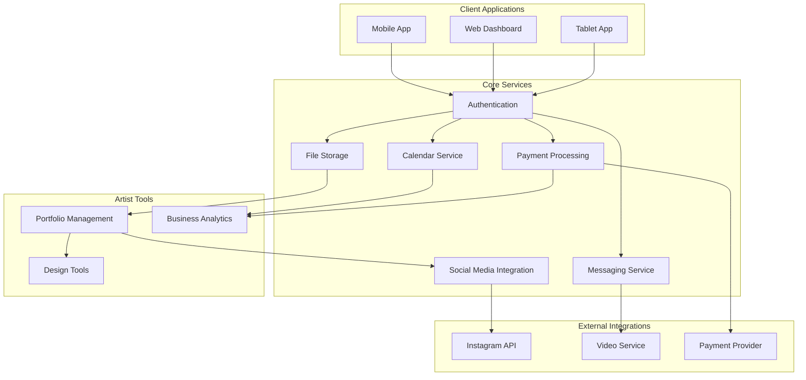
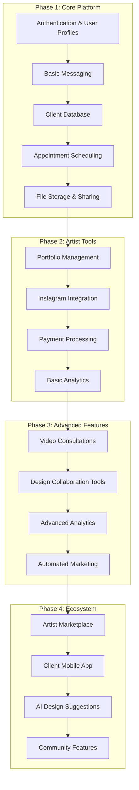
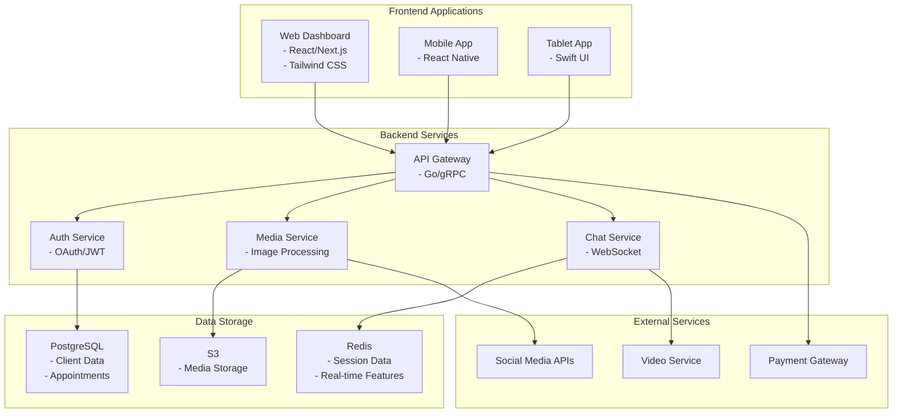
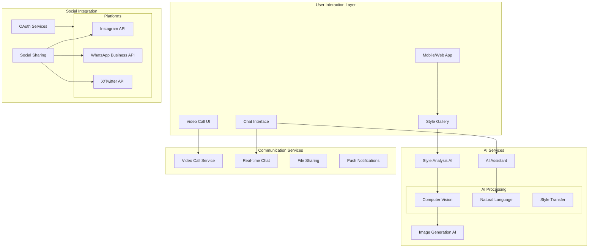
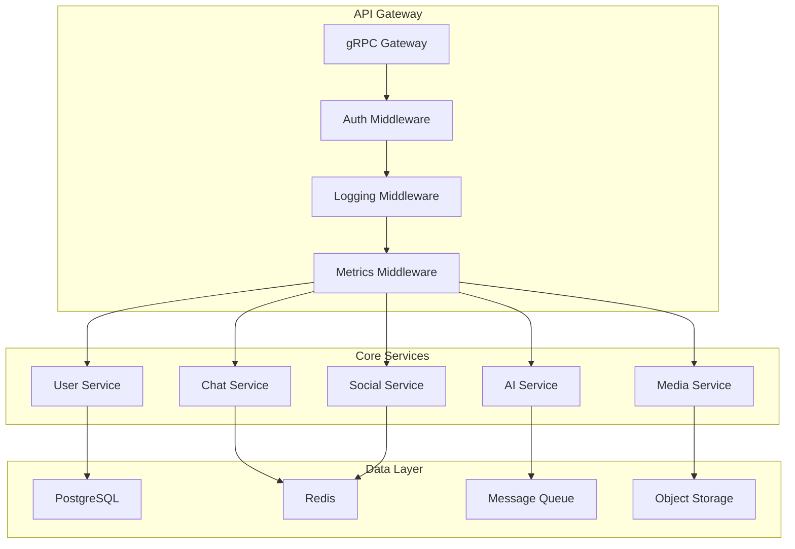

# Ink app backend gRPC

Tattoo Artist Client Management Platform
## Pros:

Solves real pain points for tattoo artists (message organization, client management)
Integration with Instagram addresses workflow issues
Focused on professional tools rather than just discovery
Could become essential business software for tattoo artists
Natural monetization through SaaS model
Integration with iOS creative tools adds unique value

Key Features:

Client Management


Organized client conversations
File/image sharing
Appointment scheduling
Client history and notes
Payment processing


Creative Tools


iOS/tablet integration for artwork
Portfolio management
Cross-posting to Instagram
Image editing capabilities


Communication


Dedicated messaging system
Video consultations
Screen sharing for design review
Calendar integration


Business Tools


Appointment scheduling
Payment processing
Analytics dashboard
Client database



Potential Feature Sets
Core Features (MVP)
Artist Onboarding & Profile Management:

User registration with secure authentication
Customizable profiles to showcase portfolios, biographies, and contact details
Client Communication & Messaging:

In-app messaging system that organizes client inquiries and prioritizes important messages
Threaded conversations and group chats for managing multiple clients
Appointment Scheduling & Calendar Integration:

Integrated calendar for booking and managing appointments
Automated reminders and notifications for upcoming sessions
Sync options with external calendars (Google, Apple Calendar)
Portfolio & Gallery Management:

Upload and manage high-resolution images of past work
Categorize and tag portfolio items for easy browsing
Social media integration to auto-share new posts (e.g., Instagram)
File Sharing & Collaboration:

Secure file sharing for design drafts, revisions, and final artwork
Support for annotated images or version control for iterative feedback
Basic Payment Processing:

In-app payment integration for deposits or full session fees via popular gateways (Stripe, PayPal)
Notifications & Alerts:

Push notifications for new messages, booking confirmations, and reminders
In-app alerts for changes in schedule or urgent client communications
Advanced Features (Phase 2+)
Enhanced Communication Tools:

Video conferencing and live chat for remote consultations
Screen sharing capabilities for design reviews or collaborative sessions
CRM & Analytics Dashboard:

Track client engagement, appointment history, and revenue metrics
Insights into popular services and portfolio performance
Advanced Social Media & Marketing Integrations:

Deeper integration with platforms like Instagram or WhatsApp for seamless cross-posting
Tools for running promotions, targeted messaging, or special offers
Augmented Reality (AR) Previews:

AR tools to allow clients to preview tattoo designs on their skin in real time
Community & Collaboration Features:

Forums or networking spaces for tattoo artists to share best practices and support each other
Integration with review systems to build credibility through client feedback
Customizable Branding & Studio Management:

Options for artists to personalize the interface with their own branding
Tools for managing studio operations, such as resource allocation or team scheduling
Development Strategies
Phase 1: MVP Development & Early User Feedback
User Research & Validation:

Interview a small group of tattoo artists to map out pain points and prioritize the most valuable features
Validate ideas through prototypes and mockups before full-scale development
Design & Prototyping:

Create wireframes and interactive prototypes focusing on ease of use and seamless client interaction
Focus on mobile-first design, given that many tattoo artists are already accustomed to working on iOS devices
Technology Stack Decisions:

Frontend: Consider frameworks like React Native or Flutter for cross-platform mobile development, and React.js for a web dashboard
Backend: Use Node.js, Python, or Go to develop RESTful or GraphQL APIs
Database: Opt for PostgreSQL or MongoDB to manage profiles, appointments, and messaging data
Cloud Services: Utilize AWS, GCP, or Azure for scalable infrastructure, and Docker/Kubernetes for containerized deployments
Agile Development:

Use an agile approach with iterative sprints and regular feedback loops
Develop a minimal set of features and roll out a beta version to a controlled group of artists
Security & Compliance:

Implement robust authentication (OAuth, JWT) and secure data transmission (HTTPS)
Ensure user data is encrypted and privacy standards are maintained from day one
Phase 2: Feature Expansion & Integration
Advanced Integrations:

Integrate with popular social media APIs (Instagram, WhatsApp) to allow automatic sharing and streamlined client interactions
Expand the messaging platform with video calling and live chat features
Payment & CRM Enhancements:

Implement a full-fledged payment processing module with transaction tracking
Develop a CRM dashboard that provides actionable insights and analytics
User Experience & Interface Improvements:

Gather in-depth user feedback from MVP testers to refine workflows
Introduce customizable branding features and additional UI/UX enhancements based on user needs
Testing & Scalability:

Scale infrastructure using cloud services and autoscaling policies to handle increased user loads
Expand testing protocols to include integration, performance, and security tests
Phase 3: Optimization, Monetization & Community Building
Monetization Models:

Explore subscription plans, commission fees, or premium features for enhanced functionalities
Consider freemium models where basic features are free, with advanced options available via subscription
Community & Ecosystem Development:

Develop features that foster a community among tattoo artists, such as forums, networking events, or collaborative tools
Introduce peer review and rating systems to build trust and credibility
Continuous Improvement & Analytics:

Use analytics to monitor usage, engagement, and system performance
Iteratively roll out new features based on user data and industry trends
Marketing & Outreach:

Launch targeted marketing campaigns to reach tattoo artists via social media, industry events, and online forums
Build partnerships with tattoo studios, art schools, and industry influencers to promote adoption




Let's break down each phase and its features:
Phase 1: Core Platform (3-4 months)

Client Management


User authentication (artist/client roles)
Client profiles with history
Document/image storage
Basic messaging
Calendar integration
Appointment scheduling


Essential Business Tools


Client database
Basic portfolio storage
Simple appointment reminders
Initial file sharing system

Phase 2: Artist Tools (2-3 months)

Portfolio Features


Multi-device sync
Custom categorization
Tagging system
Automatic portfolio generation


Social Integration


Instagram cross-posting
Social media analytics
Auto-scheduling posts
Content management


Payment Processing


Deposit collection
Final payment processing
Invoice generation
Payment tracking

Phase 3: Advanced Features (3-4 months)

Communication Tools


Video consultations
Screen sharing
Real-time design collaboration
Group chat for larger pieces


Design Tools


Basic image editing
Reference image organization
Design iteration tracking
Client approval workflow


Business Intelligence


Revenue tracking
Client analytics
Booking patterns
Popular design trends

Phase 4: Ecosystem Expansion (4-6 months)

Client-Side Features


Client mobile app
Design browsing
Artist discovery
Review system


Advanced Tools


AI-powered design suggestions
Automated scheduling
Smart pricing recommendations
Marketing automation

Let's also outline the technical implementation strategy:



Development Recommendations:

MVP Strategy


Start with web platform
Focus on core client management
Build essential communication tools
Add Instagram integration early


Technical Considerations


Use gRPC for efficient communication
Implement robust file handling
Ensure scalable real-time features
Focus on iOS integration for artists


Security Measures


Secure file sharing
Payment data protection
Client information privacy
Role-based access control


Monetization Strategy


Tiered subscription model
Transaction fees for payments
Premium features for power users
Custom deployment options


### AI and Social Integration Architecture





## Bootstrap service notifications

```protobuf
// ai_service.proto
syntax = "proto3";
package tattoo.ai;

service AIService {
  rpc AnalyzeStyle(AnalyzeStyleRequest) returns (StyleAnalysis);
  rpc GenerateImage(GenerateImageRequest) returns (GeneratedImage);
  rpc GetSuggestions(SuggestionRequest) returns (stream SuggestionResponse);
}

message AnalyzeStyleRequest {
  repeated string image_urls = 1;
  string style_preference = 2;
}

message StyleAnalysis {
  repeated string dominant_styles = 1;
  repeated string color_palette = 2;
  float complexity_score = 3;
  repeated string suggested_elements = 4;
}

// social_service.proto
syntax = "proto3";
package tattoo.social;

service SocialService {
  rpc AuthenticatePlatform(AuthRequest) returns (AuthResponse);
  rpc ShareContent(ShareRequest) returns (ShareResponse);
  rpc SyncMessages(SyncRequest) returns (stream Message);
}
```

## AI Service implementation
```go
package ai

import (
    "context"
    "github.com/your-org/tattoo-platform/proto/ai"
    "github.com/your-org/tattoo-platform/internal/vision"
    "github.com/your-org/tattoo-platform/internal/generation"
)

type AIService struct {
    visionClient  *vision.Client
    genClient     *generation.Client
    styleAnalyzer *StyleAnalyzer
}

type StyleAnalyzer struct {
    modelPath string
    cache     *redis.Client
}

func NewAIService(ctx context.Context, config Config) (*AIService, error) {
    visionClient, err := vision.NewClient(ctx, config.VisionConfig)
    if err != nil {
        return nil, fmt.Errorf("failed to create vision client: %w", err)
    }

    genClient, err := generation.NewClient(ctx, config.GenerationConfig)
    if err != nil {
        return nil, fmt.Errorf("failed to create generation client: %w", err)
    }

    return &AIService{
        visionClient:  visionClient,
        genClient:     genClient,
        styleAnalyzer: NewStyleAnalyzer(config.ModelPath),
    }, nil
}

func (s *AIService) AnalyzeStyle(ctx context.Context, req *ai.AnalyzeStyleRequest) (*ai.StyleAnalysis, error) {
    // Analyze images using computer vision
    features, err := s.visionClient.ExtractFeatures(ctx, req.ImageUrls)
    if err != nil {
        return nil, fmt.Errorf("failed to extract features: %w", err)
    }

    // Process style characteristics
    styles, err := s.styleAnalyzer.ProcessFeatures(ctx, features)
    if err != nil {
        return nil, fmt.Errorf("failed to process features: %w", err)
    }

    return &ai.StyleAnalysis{
        DominantStyles:     styles.Dominant,
        ColorPalette:       styles.Colors,
        ComplexityScore:    styles.Complexity,
        SuggestedElements:  styles.Suggestions,
    }, nil
}

func (s *AIService) GenerateImage(ctx context.Context, req *ai.GenerateImageRequest) (*ai.GeneratedImage, error) {
    // Generate image using Stable Diffusion or similar
    params := generation.Params{
        Style:       req.Style,
        Elements:    req.Elements,
        Constraints: req.Constraints,
    }

    img, err := s.genClient.Generate(ctx, params)
    if err != nil {
        return nil, fmt.Errorf("failed to generate image: %w", err)
    }

    return &ai.GeneratedImage{
        Url:         img.URL,
        Seed:        img.Seed,
        Parameters:  img.Params,
    }, nil
}
```

## Social service implementation
```go
package social

import (
    "context"
    "github.com/your-org/tattoo-platform/proto/social"
    "github.com/your-org/tattoo-platform/internal/platforms"
)

type SocialService struct {
    instagram *platforms.InstagramClient
    whatsapp  *platforms.WhatsAppClient
    twitter   *platforms.TwitterClient
    auth      *AuthManager
}

type AuthManager struct {
    tokenStore TokenStore
    crypto     *Crypto
}

func NewSocialService(ctx context.Context, config Config) (*SocialService, error) {
    auth := NewAuthManager(config.AuthConfig)

    instagram, err := platforms.NewInstagramClient(ctx, config.InstagramConfig)
    if err != nil {
        return nil, fmt.Errorf("failed to create Instagram client: %w", err)
    }

    whatsapp, err := platforms.NewWhatsAppClient(ctx, config.WhatsAppConfig)
    if err != nil {
        return nil, fmt.Errorf("failed to create WhatsApp client: %w", err)
    }

    twitter, err := platforms.NewTwitterClient(ctx, config.TwitterConfig)
    if err != nil {
        return nil, fmt.Errorf("failed to create Twitter client: %w", err)
    }

    return &SocialService{
        instagram: instagram,
        whatsapp:  whatsapp,
        twitter:   twitter,
        auth:      auth,
    }, nil
}

func (s *SocialService) ShareContent(ctx context.Context, req *social.ShareRequest) (*social.ShareResponse, error) {
    results := make([]*social.ShareResult, 0)

    if req.Instagram {
        result, err := s.instagram.Share(ctx, req.Content)
        if err != nil {
            // Log error but continue with other platforms
            log.WithError(err).Error("failed to share on Instagram")
        } else {
            results = append(results, result)
        }
    }

    if req.WhatsApp {
        result, err := s.whatsapp.Share(ctx, req.Content)
        if err != nil {
            log.WithError(err).Error("failed to share on WhatsApp")
        } else {
            results = append(results, result)
        }
    }

    return &social.ShareResponse{
        Results: results,
    }, nil
}

func (s *SocialService) SyncMessages(ctx context.Context, req *social.SyncRequest) (<-chan *social.Message, error) {
    messageChan := make(chan *social.Message)

    go func() {
        defer close(messageChan)

        // Sync messages from each platform concurrently
        var wg sync.WaitGroup
        wg.Add(3)

        go func() {
            defer wg.Done()
            s.instagram.StreamMessages(ctx, req.Since, messageChan)
        }()

        go func() {
            defer wg.Done()
            s.whatsapp.StreamMessages(ctx, req.Since, messageChan)
        }()

        go func() {
            defer wg.Done()
            s.twitter.StreamMessages(ctx, req.Since, messageChan)
        }()

        wg.Wait()
    }()

    return messageChan, nil
}
```

## Configuration
```go
package config

import (
    "github.com/spf13/viper"
)

type Config struct {
    AI     AIConfig     `mapstructure:"ai"`
    Social SocialConfig `mapstructure:"social"`
    DB     DBConfig     `mapstructure:"db"`
    Redis  RedisConfig  `mapstructure:"redis"`
}

type AIConfig struct {
    ModelPath        string `mapstructure:"model_path"`
    StableDiffusion struct {
        Endpoint string `mapstructure:"endpoint"`
        APIKey   string `mapstructure:"api_key"`
    } `mapstructure:"stable_diffusion"`
}

type SocialConfig struct {
    Instagram struct {
        ClientID     string `mapstructure:"client_id"`
        ClientSecret string `mapstructure:"client_secret"`
        RedirectURI  string `mapstructure:"redirect_uri"`
    } `mapstructure:"instagram"`
    WhatsApp struct {
        BusinessID string `mapstructure:"business_id"`
        APIKey     string `mapstructure:"api_key"`
    } `mapstructure:"whatsapp"`
}

func LoadConfig() (*Config, error) {
    viper.SetConfigName("config")
    viper.SetConfigType("yaml")
    viper.AddConfigPath(".")
    viper.AddConfigPath("./config")

    if err := viper.ReadInConfig(); err != nil {
        return nil, fmt.Errorf("failed to read config: %w", err)
    }

    var config Config
    if err := viper.Unmarshal(&config); err != nil {
        return nil, fmt.Errorf("failed to unmarshal config: %w", err)
    }

    return &config, nil
}
```

Key implementation points:

Service Organization:


Use gRPC for service communication
Implement middleware for auth, logging, and metrics
Use context for cancellation and timeouts
Implement graceful shutdown


Error Handling:


Use custom error types
Implement proper error wrapping
Add error logging with context


Security:


Implement rate limiting
Add input validation
Use secure token storage
Implement proper RBAC


Performance:


Use connection pooling
Implement caching where appropriate
Use goroutines for concurrent operations
Handle backpressure


